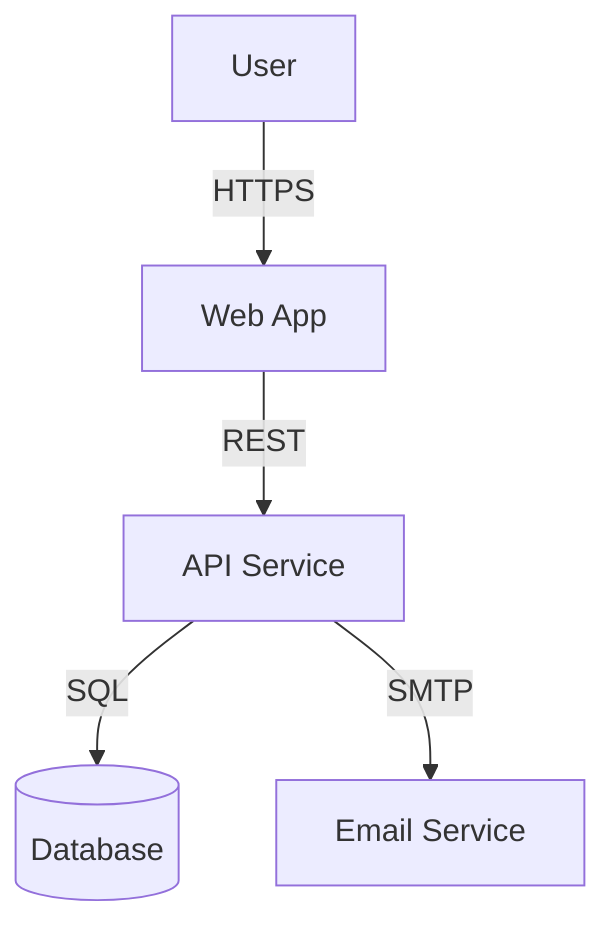
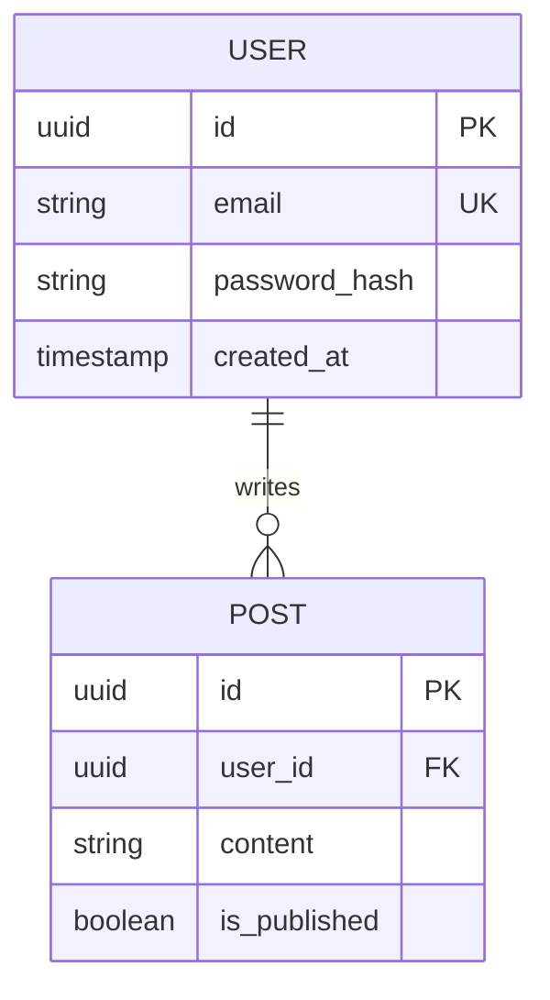

# Software Architecture Standards

Guidelines for translating requirements into technical specifications.

## Requirement Analysis Patterns

### User Story Template
```markdown
### Title: [Feature Name]

**As a** [role],
**I want to** [action],
**So that** [benefit].

**Acceptance Criteria:**
- [ ] Criterion 1
- [ ] Criterion 2
```

## System Context Diagram (Mermaid)

Use Mermaid to define high-level system interactions.


## API Design Patterns

### RESTful Contract Definition

Define APIs using concise Markdown tables or OpenAPI snippets.
```yaml
# OpenAPI / Swagger Style
paths:
  /users/{id}:
    get:
      summary: Get user by ID
      parameters:
        - name: id
          in: path
          required: true
          schema:
            type: string
            format: uuid
      responses:
        '200':
          description: OK
          content:
            application/json:
              schema:
                $ref: '#/components/schemas/User'
```

## Response Standardization

All APIs must follow this envelope structure:
```json
{
  "success": true,
  "data": { ... },
  "meta": {
    "page": 1,
    "total": 100
  },
  "error": null
}
```

## Database Modeling Patterns

### ER Diagram Standard


### Naming Conventions
* Tables: Plural, snake_case (e.g., users, order_items)
* Columns: snake_case (e.g., created_at, user_id)
* Primary Keys: id (UUIDv4 preferred for distributed systems)

## Architecture Decision Records (ADR)

When making significant technical choices, use this format:
```markdown
# ADR-001: Use PostgreSQL
## Status
Accepted

## Context
We need a relational database that supports complex queries and JSON types.

## Decision
Use PostgreSQL 15+.

## Consequences
- Better support for JSONB operations compared to MySQL.
- Requires slightly more memory for connection handling.
```
