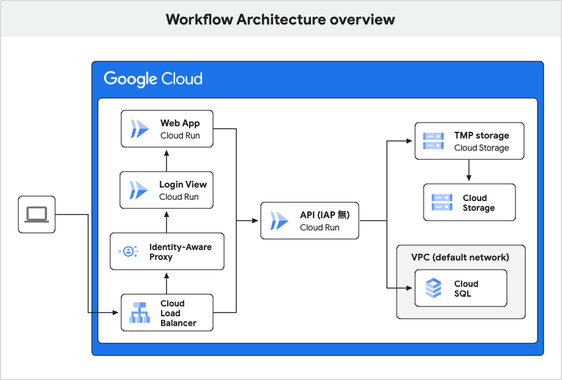

## 構成

## 設定する必要がある環境変数
| 環境変数 | 例 | Secret Manager |
| ------- | --- | --- |
| DB_HOST | 10.60.2.3 | |
| DB_PORT | 5432 | |
| DB_NAME | postgres | |
| DB_USER | postgres | |
| DB_PASS | postgres | ○ |
| TMP_UPLOAD_BUCKET_NAME | tmp-bucket | |
| PERSISTIBLE_BUCKET_NAME | data-bucket | |
| SENDGRID_API_KEY | XXxx.xxxxxxxx | ○ |
| MAIL_SENDER | hoge@gmail.com | |

## SendGrid の準備  
https://app.sendgrid.com/
1. SendGrid で API Key を発行します。
2. SendGrid 側で Sender などの設定を完了させます。

## Google Cloud リソースの準備
1. AlloyDB インスタンスを作成します。
2. Cloud Storage バケットを作成します。
3. AlloyDB (PostgreSQL) に必要なテーブルを作成します。

## Cloud Run デプロイ
1. (Optional) Google Cloud コンソールで Cloud Run と GitHub を連携させます。
2. ソースコードを Cloud Run にデプロイします。このサンプルコードは Web と API の実装を混ぜているので、同じコンテナを 2 サービス（Web / API）にデプロイします。
3. Direct VPC Egress を設定し、AlloyDB のネットワークに接続します。

## 設定の追加
1. Cloud Run サービスに必要な環境変数を設定します。
2. 機密情報は Secret Manager に保存し、Cloud Run から参照できるようにします。

## ロードバランサーの設定
1. GCLB (Application Load Balancer) を作成します。 `/api/*` は API サービス、他は Web へルーティングさせます。
2. SSL 証明書を作成し、GCLB にアタッチします。
3. Cloud DNS などで、ドメインと GCLB の IP アドレスを A レコードに紐づけます。

## Identity Platform のセットアップ
1. Identity Platform でメール/パスワード認証を有効にします。
2. 必要なユーザーアカウントを追加します。

## Identity Aware Proxy (IAP) の設定
1. Cloud Run サービスに IAP を有効にします。
2. Identity Platform でログインするように IAP を設定します。
