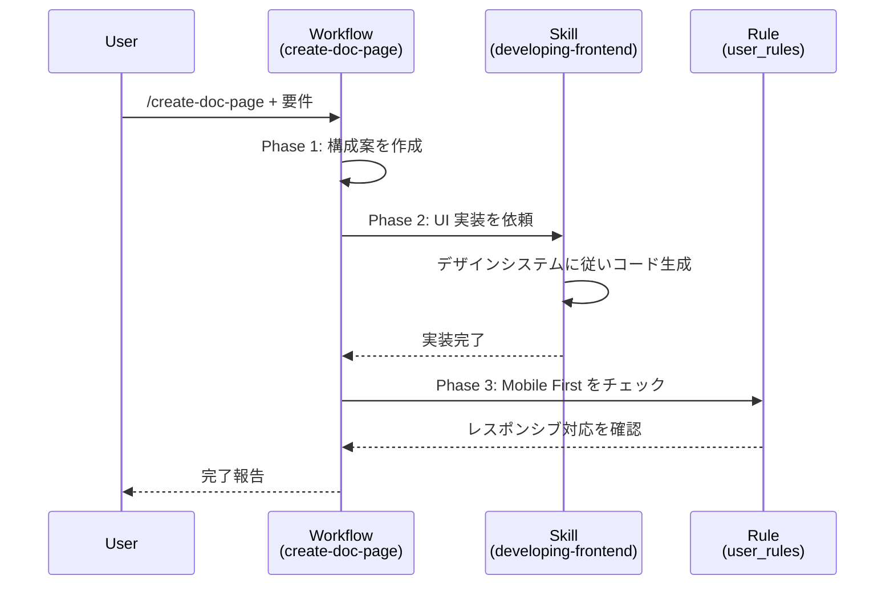

# Antigravity Practice: Modern Apparel EC で学ぶ AI エージェント開発

このハンズオンでは、アパレル EC サイト「**Modern Apparel EC**」を題材に、Antigravity の **3 大要素（Skills, Rules, Workflows）** が実際のプロジェクトでどのように構成され、開発を加速させるかを体験します。

---

## 🎯 ゴール

本プロジェクトのコードベースを通じて、以下を理解する:

1. **Rules** がエージェントの行動をどのように制約するか
2. **Skills** が専門知識をどのように提供するか
3. **Workflows** がプロセスをどのように自動化するか
4. 3 要素の **連携** によって、どのように開発品質が担保されるか

---

## Step 1: Rules — エージェントの行動規範

**Rules** は、エージェントが常に遵守すべきルールです。明示的な指示がなくてもルールに従って行動します。

### 📂 ファイル構成

```
.agent/rules/
├── user_rules.md        # UI デザイン憲法（常時適用）
└── product-manager.md   # プロジェクト横断ルール
```

### 🔍 `user_rules.md` — UI デザイン憲法

```yaml
---
trigger: always_on
---
```

常時適用される 3 つのルール:

| ルール | 内容 |
|---|---|
| **Mobile First** | すべての UI はモバイル画面を最優先。PC 表示は拡張 |
| **Accessibility** | すべての画像に `alt` 属性を必須とする |
| **Consistency** | 配色は Tailwind の `slate` ベース、ブランドカラーは `indigo-600` |

> **Point**: このルールにより、エージェントは指示なしでも `w-full md:w-auto` のようなレスポンシブ対応コードを生成します。

### 🔍 `product-manager.md` — プロジェクトルール

データベース設計、Git ワークフロー、設計記録に関するプロジェクト全体のルールを定義しています:

- **DB**: UUIDv4 を PK に使用（ホットスポット回避）、親子テーブルは Interleaving
- **Git**: Conventional Commits（`feat:`, `fix:`, `docs:` 等）
- **設計記録**: ADR は `docs/adr/` に記録、ダイアグラムは Mermaid

---

## Step 2: Skills — 専門スキルの定義

**Skills** は、エージェントに特定分野の専門知識を付与する仕組みです。各スキルは `SKILL.md` に知識・パターン・ガイドラインを記述します。

### 📂 ファイル構成

```
.agent/skills/
├── analyzing-requirements/    # ビジネス要件分析
│   └── SKILL.md
├── designing-api/             # API 設計（OpenAPI, REST）
│   └── SKILL.md
├── developing-backend/        # バックエンド実装（FastAPI, Spanner）
│   ├── SKILL.md
│   └── resources/             # リファレンスコード等
├── developing-frontend/       # フロントエンド実装（React, Tailwind）
│   ├── SKILL.md
│   └── resources/             # デザインシステム定義等
├── deploying-infrastructure/  # インフラ（Terraform, Cloud Run, CI/CD）
│   └── SKILL.md
└── testing-code/              # テスト（pytest, Playwright）
    └── SKILL.md
```

### 🔍 スキルの役割分担

| スキル | 役割 | 使用場面 |
|---|---|---|
| `analyzing-requirements` | 要件分析・技術仕様書作成 | 新機能の要件明確化 |
| `designing-api` | RESTful API 設計 | エンドポイント定義・スキーマ設計 |
| `developing-backend` | FastAPI + Spanner 実装 | API・サービス・リポジトリ実装 |
| `developing-frontend` | React + Tailwind 実装 | UI コンポーネント・ページ作成 |
| `deploying-infrastructure` | GCP インフラ管理 | デプロイ・CI/CD 構築 |
| `testing-code` | テスト作成・保守 | ユニット/統合/E2E テスト |

> **Point**: スキルには `resources/` ディレクトリを持つものがあり、デザインシステム定義やリファレンスコードなど、具体的なパターンを提供します。

---

## Step 3: Workflows — 品質を担保するプロセス

**Workflows** は、エージェントが実行する作業手順書です。単なるコード生成ではなく、**「設計 → 実装 → 検証」** のプロセスを定義し、品質を担保します。

### 📂 ファイル構成

```
.agent/workflows/
├── create-doc-page.md   # ドキュメントページ作成
├── front-qa-basic.md    # フロントエンド基本 QA テスト
└── cart-qa-basic.md     # カート機能 QA テスト
```

### 🔍 Workflow 1: `create-doc-page` — ドキュメントページ作成

新しい解説ページを追加するための 3 フェーズのワークフロー:

| Phase | やること |
|---|---|
| **1. 構成案** | ユーザーの要望からページ構成案を提案、ファイルパスを決定 |
| **2. 実装** | `developing-frontend` スキルのデザインシステムに従って UI を実装、ルーターに追加 |
| **3. 検証** | Mobile First ルールの自己レビュー |

**使い方:**
```text
/create-doc-page
「API認証 (Authentication)」についての解説ページを追加してください。
```

### 🔍 Workflow 2: `front-qa-basic` — フロントエンド QA

エージェントが **QA 担当者として Web ブラウザを実際に操作** し、以下のフローをテストします:

1. トップページの表示確認
2. 商品詳細ページへの遷移・表示確認
3. カテゴリ一覧ページへの遷移・表示確認
4. 最終評価（【承認】or【却下】判定）

各ステップでスクリーンショットを撮影し、コンソールエラーの有無も確認します。

### 🔍 Workflow 3: `cart-qa-basic` — カート機能 QA

カート機能のエンドツーエンドテスト:

1. 開発サーバーの起動（バックエンド + フロントエンド）
2. 商品詳細ページで**カラー・サイズを選択**してカートに追加
3. カートページで**商品情報・合計金額**を確認
4. **数量変更**（+/-）と金額再計算の確認
5. **商品削除**と空カート表示の確認
6. 最終評価

> **Point**: `// turbo` アノテーションにより、サーバー起動などの定型コマンドは自動実行されます。

---

## Step 4: The Integration — 3 要素の連携を体験する

### 🎯 実行シナリオ

あなたは PM として、「API 認証 (Authentication) の解説ページ」をポータルに追加したいと考えています。

### Golden Prompt

```text
/create-doc-page
「API認証 (Authentication)」についての解説ページを追加してください。
内容は以下の通り：
1. ヘッダーに `Authorization: Bearer <token>` が必要であること。
2. トークンがない場合は 401 エラーが返ること（これは Info Alert で目立たせたい）。
3. cURL のリクエスト例を載せること。
```

### 🧠 エージェントの動作（連携の可視化）



1. **Workflow 起動**: `/create-doc-page` を検知し、ワークフローモードに入る
2. **Phase 1 (構成案)**: ページの構成・ファイルパスを決定
3. **Phase 2 (実装)**:
   - `developing-frontend` スキルを読み込み
   - デザインシステムのカラーパレット・コンポーネントパターンに従いコードを生成
   - `App.tsx` にルーティングを追加
4. **Phase 3 (検証)**:
   - `user_rules.md` の Mobile First ルールに照らし合わせて自己レビュー
   - `overflow-x-auto` の追加など、モバイル対応を確認

---

## Conclusion: Antigravity の真価

このハンズオンで体験したのは、単なるコード生成ではありません。

| 要素 | 役割 | 効果 |
|---|---|---|
| **Rules** | 品質のベースライン | 明示的な指示なしでも Mobile First・アクセシビリティ対応 |
| **Skills** | 専門的な実装知識 | プロジェクト固有のデザインシステム・アーキテクチャパターンを適用 |
| **Workflows** | プロセスの自動化 | 設計→実装→検証の手順を強制し、品質を均一化 |

これらを組み合わせることで、**「指示出し」の負担を最小限にしつつ、常に高品質なアウトプットを得る**ことができます。

---

## 付録: ローカル環境のセットアップ

ハンズオンを実際に試す場合は、[README.md](./README.md) の「ローカル開発」セクションを参照してください。
